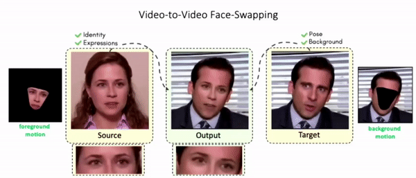
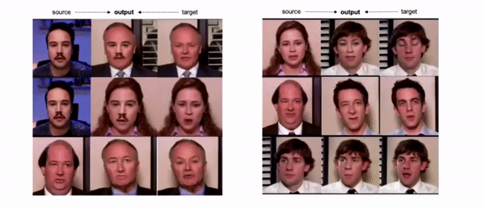
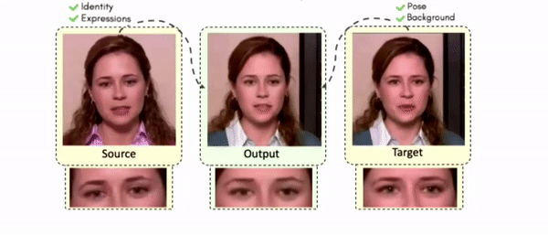
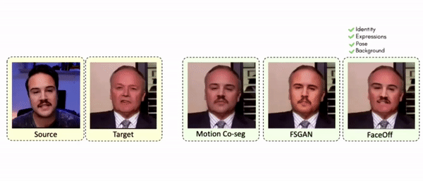
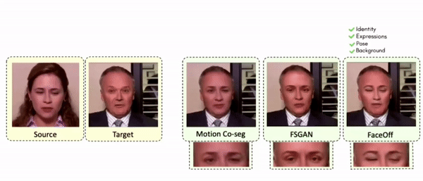
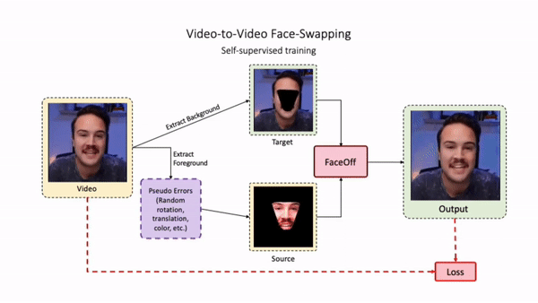

# FaceOff: A Video-to-Video Face Swapping System

[Aditya Agarwal](http://skymanaditya1.github.io/)<sup>\*1</sup>,
[Bipasha Sen](https://bipashasen.github.io/)<sup>\*1</sup>,
[Rudrabha Mukhopadhyay](https://rudrabha.github.io/)<sup>1</sup>,
[Vinay Namboodiri](https://vinaypn.github.io/)<sup>2</sup>,
[C V Jawahar](https://faculty.iiit.ac.in/~jawahar/)<sup>1</sup><br>
<sup>1</sup>International Institute of Information Technology, Hyderabad, <sup>2</sup>University of Bath

<sup>\*</sup>denotes equal contribution

This is the official implementation of the paper "FaceOff: A Video-to-Video Face Swapping System" **published** at WACV 2023.

For more results, information, and details visit our [**project page**](http://cvit.iiit.ac.in/research/projects/cvit-projects/faceoff) and read our [**paper**](https://openaccess.thecvf.com/content/WACV2023/papers/Agarwal_FaceOff_A_Video-to-Video_Face_Swapping_System_WACV_2023_paper.pdf). Following are some outputs from our network on the V2V Face Swapping Task.





## Results on same identity


## Comparisons 



## Getting started

1. Set up a conda environment with all dependencies using the following commands:

    ```
    conda env create -f environment.yml
    conda activate faceoff
    ```

## Training FaceOff



The following command trains the V2V Face Swapping network. At set intervals, it will generate the data on the validation dataset.

```
CUDA_VISIBLE_DEVICES=0,1,2,3 python train_faceoff_perceptual.py
```
**Parameters**<br>
Below is the full list of parameters

```--dist_url``` - port on which experiment is run <br>
```--batch_size``` - batch size, default is ```32``` <br>
```--size``` - image size, default is ```256``` <br>
```--epoch``` - number of epochs to train for <br>
```--lr``` - learning rate, default is ```3e-4```
```--sched``` - scheduler to use <br>
```--checkpoint_suffix``` - folder where checkpoints are saved, in default mode a random folder name is created <br>
```--validate_at``` - number of steps after which validation is performed, default is ```1024``` <br>
```--ckpt``` - indicates a pretrained checkpoint, default is None <br>
```--test``` - whether testing the model <br>
```--gray``` - whether testing on gray scale <br>
```--colorjit``` - type of color jitter to add, ```const```, ```random``` or ```empty``` are the possible options <br>
```--crossid``` - whether cross id required during validation, default is ```True``` <br>
```--custom_validation``` - used to test FaceOff on two videos, default is ```False``` <br>
```--sample_folder``` - path where the validation videos are stored <br>
```--checkpoint_dir``` - dir path where checkpoints are saved <br>
```--validation_folder``` - dir path where validated samples are saved <br>

All the values can be left at their default values to train FaceOff in the vanilla setting. An example is given below: 

```
CUDA_VISIBLE_DEVICES=0,1,2,3 python train_faceoff_perceptual.py
```

## We would love your contributions to improve FaceOff

FaceOff introduces the novel task of Video-to-Video Face Swapping that tackles a pressing challenge in the moviemaking industry: swapping the actor's face and expressions on the face of their body double. Existing face-swapping methods swap only the identity of the source face without swapping the source (actor) expressions which is undesirable as the starring actor's source expressions are paramount. In video-to-video face swapping, we swap the source's facial expressions along with the identity on the target's background and pose. Our method retains the face and expressions of the source actor and the pose and background information of the target actor. Currently, our model has a few limitations - i) it cannot generate samples of very high-quality, which is typically required in the movie-making industry, ii) there are noticeable temporal jitters in some of the examples, and iii) although FaceOff is designed for the movie-making industry, it would be nice to handle extreme pose variations. ***we would like to strongly encourage contributions and spur further research into some of the limitations listed above.***

## Thanks

### VQVAE2

We would like to thank the authors of [VQVAE2](https://arxiv.org/pdf/1906.00446.pdf) ([https://github.com/rosinality/vq-vae-2-pytorch])(https://github.com/rosinality/vq-vae-2-pytorch) for releasing the code. We modify on top of their codebase for performing V2V Face Swapping. 

## Citation
If you find our work useful in your research, please cite:
```
@InProceedings{Agarwal_2023_WACV,
    author    = {Agarwal, Aditya and Sen, Bipasha and Mukhopadhyay, Rudrabha and Namboodiri, Vinay P. and Jawahar, C. V.},
    title     = {FaceOff: A Video-to-Video Face Swapping System},
    booktitle = {Proceedings of the IEEE/CVF Winter Conference on Applications of Computer Vision (WACV)},
    month     = {January},
    year      = {2023},
    pages     = {3495-3504}
}
```

## Contact
If you have any questions, please feel free to email the authors.

Aditya Agarwal: aditya.ag@research.iiit.ac.in <br>
Bipasha Sen: bipasha.sen@research.iiit.ac.in <br>
Rudrabha Mukhopadhyay: radrabha.m@research.iiit.ac.in <br>
Vinay Namboodiri: vpn22@bath.ac.uk <br>
C V Jawahar: jawahar@iiit.ac.in <br>